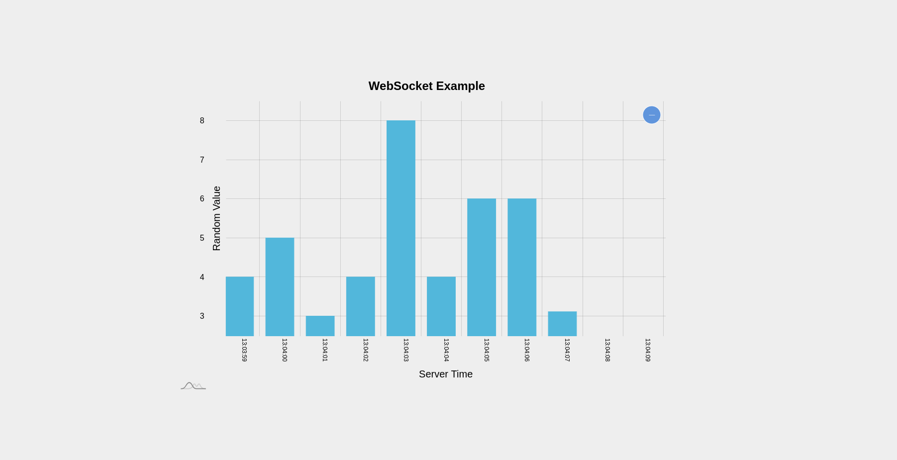

# Simple Angular 19 and .Net API communicating using Websockets

### Angular Client:
- `cd /client/`
- `npm install`
- `ng serve`
-  Client is running at: http://localhost:4200

### .Net Server:
- `cd /server/`
- `dotnet restore`
- `dotnet watch`

